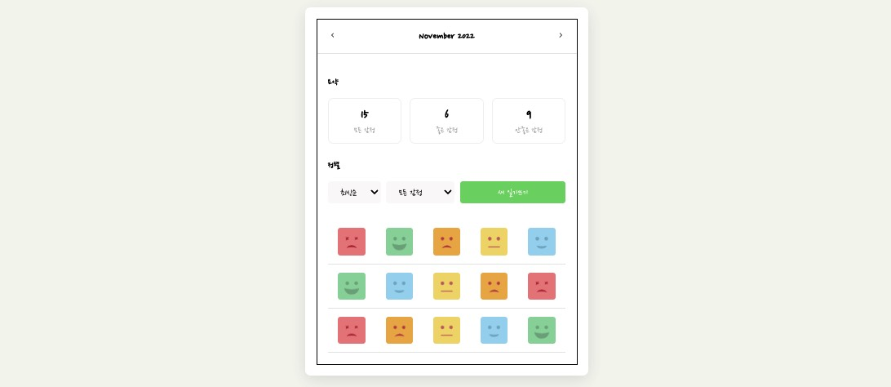

# React Emotion Diary App

간단한 CRUD 기능을 갖춘 감성 일기장 애플리케이션.

**웹 배포 : [https://prototypediary.netlify.app/](https://prototypediary.netlify.app/)**

#### Made with 🐥 by [Pazival8971](https://github.com/Parzival8971)

---

## 프로젝트 설명

이 프로젝트는 Todo 애플리케이션을 활용하여, `감정 일기 다이어리`를 만듭니다.
간단한 CURD 기능을 갖추고 작업을 수행하였습니다. `React.js`를 사용하고, 상태를 관리하기 위해 `Redux`를 사용하였습니다. UI 부분은 `CSS`을 사용하였습니다. 이 앱을 만들면서 소규모이지만, `React`의 컴포넌트 단위의 재사용의 중요성과 성능개선을 위한 메모이제이션 처리에 대해 학습을 중점으로 만들었습니다.

---

## 사용한 라이브러리

- [React](https://reactjs.org/)
- [react-router-dom](https://reactrouter.com/)
- [React Redux](https://redux.js.org/)
- [React icons](https://react-icons.netlify.com/)
- [shortid](https://github.com/dylang/shortid)

## 요구사항

- 기초 React.js 지식
- 기초 HTML, CSS 지식
- 기초 Typescript 지식
- HTML Web Storage API 지식

## 시작하기

시작 파일을 가져온 후 파일 디렉토리로 이동하여 다음을 시행합니다.

```shell
npm install
```

그러고 난 후 개발 서버를 띄어주세요.

```shell
npm start
```

## 사용한 에디터

코드 에디터 : [VS Code](https://code.visualstudio.com/)

---

## 참고자료

참고 강의 : udemy한입 크기로 잘라 먹는 리액트(React.js)  
(https://www.udemy.com/course/winterlood-react-basic/)

공부하자 달려라! 🔥
